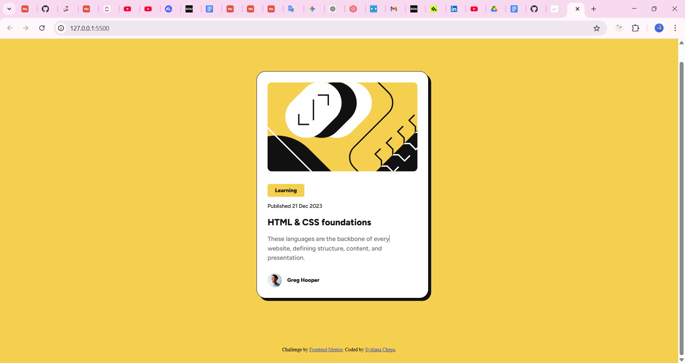

# Frontend Mentor - Blog preview card solution

This is my solution to the Blog Preview Card challenge on Frontend Mentor. The goal was to build a responsive card component with hover and focus states.

## Table of contents

- [Overview](#overview)
  - [The challenge](#the-challenge)
  - [Screenshot](#screenshot)
  - [Links](#links)
- [My process](#my-process)
  - [Built with](#built-with)
  - [What I learned](#what-i-learned)
  - [Continued development](#continued-development)
- [Author](#author)

## Overview

### The challenge

Users should be able to:

- See hover and focus states for all interactive elements
### Screenshot




### Links

- Solution URL: [Add solution URL here](https://github.com/Vall-Re/frontend_dev_blog-preview-card)

- Live Site URL: [Add live site URL here](https://vall-re.github.io/frontend_dev_blog-preview-card/)

## My process

### Built with

- Semantic HTML5 markup
- CSS custom properties
- Flexbox
- CSS Grid
- Mobile-first workflow

### What I learned

While building this project I practiced:

- Creating responsive layouts using mobile-first approach

- Working with hover states

- Using border-radius and shadows correctly

- Structuring clean semantic HTML

```css
.title:hover {
  color: #F4D04E;
  cursor: pointer;
}
```

### Continued development

In future projects I want to:

- Improve my responsive design skills

- Write cleaner and more scalable CSS

- Practice using Grid more confidently

## Author

- Website - [GitHub](https://github.com/Vall-Re)
- Frontend Mentor - [@Vall-Re](https://www.frontendmentor.io/profile/Vall-Re)
